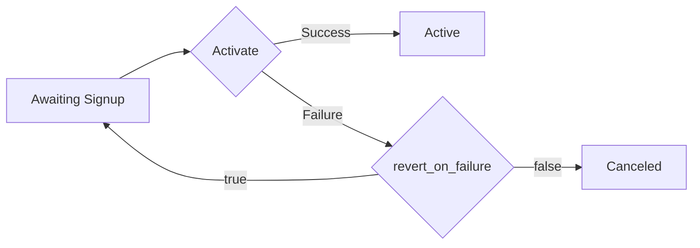

# Subscriptions

```java
SubscriptionsController subscriptionsController = client.getSubscriptionsController();
```

## Class Name

`SubscriptionsController`

## Methods

* [Create Subscription](../../doc/controllers/subscriptions.md#create-subscription)
* [List Subscriptions](../../doc/controllers/subscriptions.md#list-subscriptions)
* [Update Subscription](../../doc/controllers/subscriptions.md#update-subscription)
* [Read Subscription](../../doc/controllers/subscriptions.md#read-subscription)
* [Override Subscription](../../doc/controllers/subscriptions.md#override-subscription)
* [Find Subscription](../../doc/controllers/subscriptions.md#find-subscription)
* [Purge Subscription](../../doc/controllers/subscriptions.md#purge-subscription)
* [Update Prepaid Subscription Configuration](../../doc/controllers/subscriptions.md#update-prepaid-subscription-configuration)
* [Preview Subscription](../../doc/controllers/subscriptions.md#preview-subscription)
* [Apply Coupons to Subscription](../../doc/controllers/subscriptions.md#apply-coupons-to-subscription)
* [Remove Coupon from Subscription](../../doc/controllers/subscriptions.md#remove-coupon-from-subscription)
* [Activate Subscription](../../doc/controllers/subscriptions.md#activate-subscription)


# Create Subscription

Creates a Subscription for a customer and product.

Specify the product with `product_id` or `product_handle`. To set a specific product price point, use `product_price_point_handle` or `product_price_point_id`.

Identify an existing customer with `customer_id` or `customer_reference`. Optionally, include an existing payment profile using `payment_profile_id`. To create a new customer, pass customer_attributes.

Select an option from the **Request Examples** drop-down on the right side of the portal to see examples of common scenarios for creating subscriptions.

## List vs Sales Pricing

When a subscription uses custom pricing as the sales price, you can optionally provide a list price for any item. If omitted, the list price defaults to the sales price. The difference between the list price and sales price is used to calculate implicit discounts, which appear on Invoices and in reporting. List price can also support revenue allocations in [Advanced Revenue](https://docs.maxio.com/hc/en-us/articles/24177001342861-Create-and-Configure-RevenueBooks).

If your site has list pricing enabled, the API accepts `custom_price.list_price_point_id` for custom pricing, validates and persists it, and returns list price metadata in subscription responses. If list pricing is disabled, this input is ignored and related response fields are omitted.

When list pricing is enabled:

- Subscription → Product `product_price_point_list_price_point_id` (integer)
- `product_price_point_list_price_point_handle` (string)
- Subscription Components (when components are included in the response, such as with subscriptions built from components or component serialization paths) `component_id` (integer)
- `price_point_id` (integer)
- `list_price_point_id` (integer)

When list pricing is disabled:

- Subscription → Product `product_price_point_list_price_point_id`: omitted
- `product_price_point_list_price_point_handle`: omitted
- Subscription Components `list_price_point_id`: omitted

This functionality is supported in the API, but is not currently supported in SDKs.

## Subscriptions can now work independently from the catalog

If you have the new [Catalog experience](page:help/announcements/2026-announcements#new-catalog-experience-and-terminology) enabled, you can create subscriptions without a `product_id` or `product_handle` using POST /subscriptions, building them entirely from components.

A valid subscription must include at least one active component with:

- a positive `allocated_quantity`,
- a positive `unit_balance`, or
- 'enabled: true' (for on/off components)
- a configured metered component

`component_id` can be provided as a numeric ID or in handle: format. If `trial_interval` and `trial_interval_unit` are included, they are applied at creation.

In the response, product and product price point fields are null, and component details are returned instead.

This functionality is supported in the API, but is not currently supported in SDKs.

## Payment information

Payment information may be required to create a subscription, depending on the options for the Product being subscribed. See [product options](https://docs.maxio.com/hc/en-us/articles/24261076617869-Edit-Products) for more information. See the [Payments Profile](../../doc/controllers/payment-profiles.md#create-payment-profile) endpoint for details on payment parameters.
See the [Subscription Signups](page:introduction/basic-concepts/subscription-signup) article for more information on working with subscriptions in Advanced Billing.

## Payment information

Payment information may be required to create a subscription, depending on the options for the Product being subscribed. See [product options](https://docs.maxio.com/hc/en-us/articles/24261076617869-Edit-Products) for more information. See the [Payments Profile](../../doc/controllers/payment-profiles.md#create-payment-profile) endpoint for details on payment parameters.

Do not use real card information for testing. See the Sites articles that cover [testing your site setup](https://docs.maxio.com/hc/en-us/articles/24250712113165-Testing-Overview#testing-overview-0-0) for more details on testing in your sandbox.

Note that collecting and sending raw card details in production requires [PCI compliance](https://docs.maxio.com/hc/en-us/articles/24183956938381-PCI-Compliance#pci-compliance-0-0) on your end. If your business is not PCI compliant, use [Maxio.js (formerly Chargify.js)](https://docs.maxio.com/hc/en-us/articles/38163190843789-Chargify-js-Overview#chargify-js-overview-0-0) to collect credit card or bank account information.

## 3D Secure (3DS) Authentication post-authentication flow

When a payment requires 3DS Authentication to adhere to Strong Customer Authentication (SCA), the request enters a post-authentication flow where a 422 Unprocessable Entity status is returned with an action_link that will direct the customer through 3DS Authentication.

See the [3D Secure Post-Authentication Flow](https://docs.maxio.com/hc/en-us/articles/44277749524365-3D-Secure-Post-Authentication-Flow) article in the product documentation to learn how to manage the redirect flow.

```java
SubscriptionResponse createSubscription(
    final CreateSubscriptionRequest body)
```

## Authentication

This endpoint requires [BasicAuth](../../doc/auth/basic-authentication.md)

## Parameters

| Parameter | Type | Tags | Description |
|  --- | --- | --- | --- |
| `body` | [`CreateSubscriptionRequest`](../../doc/models/create-subscription-request.md) | Body, Optional | - |

## Response Type

**201**: Created

[`SubscriptionResponse`](../../doc/models/subscription-response.md)

## Example Usage

```java
CreateSubscriptionRequest body = new CreateSubscriptionRequest.Builder(
    new CreateSubscription.Builder()
        .productHandle("basic")
        .paymentCollectionMethod(CollectionMethod.REMITTANCE)
        .customerAttributes(new CustomerAttributes.Builder()
            .firstName("Joe")
            .lastName("Smith")
            .email("joe@example.com")
            .organization("Acme")
            .reference("XYZ")
            .address("123 Mass Ave.")
            .address2("address_24")
            .city("Boston")
            .state("MA")
            .zip("02120")
            .country("US")
            .phone("(617) 111 - 0000")
            .build())
        .build()
)
.build();

try {
    SubscriptionResponse result = subscriptionsController.createSubscription(body);
    System.out.println(result);
} catch (ErrorListResponseException e) {
    e.printStackTrace();
} catch (ApiException e) {
    e.printStackTrace();
}
```

## Example Response *(as JSON)*

```json
{
  "subscription": {
    "id": 15236915,
    "state": "active",
    "balance_in_cents": 0,
    "total_revenue_in_cents": 14000,
    "product_price_in_cents": 1000,
    "product_version_number": 7,
    "current_period_ends_at": "2016-11-15T14:48:10-05:00",
    "next_assessment_at": "2016-11-15T14:48:10-05:00",
    "trial_started_at": null,
    "trial_ended_at": null,
    "activated_at": "2016-11-14T14:48:12-05:00",
    "expires_at": null,
    "created_at": "2016-11-14T14:48:10-05:00",
    "updated_at": "2016-11-14T15:24:41-05:00",
    "cancellation_message": null,
    "cancellation_method": "merchant_api",
    "cancel_at_end_of_period": null,
    "canceled_at": null,
    "current_period_started_at": "2016-11-14T14:48:10-05:00",
    "previous_state": "active",
    "signup_payment_id": 162269766,
    "signup_revenue": "260.00",
    "delayed_cancel_at": null,
    "coupon_code": "5SNN6HFK3GBH",
    "payment_collection_method": "automatic",
    "snap_day": null,
    "reason_code": null,
    "receives_invoice_emails": false,
    "customer": {
      "first_name": "Curtis",
      "last_name": "Test",
      "email": "curtis@example.com",
      "cc_emails": "jeff@example.com",
      "organization": "",
      "reference": null,
      "id": 14714298,
      "created_at": "2016-11-14T14:48:10-05:00",
      "updated_at": "2016-11-14T14:48:13-05:00",
      "address": "123 Anywhere Street",
      "address_2": "",
      "city": "Boulder",
      "state": "CO",
      "zip": "80302",
      "country": "US",
      "phone": "",
      "verified": false,
      "portal_customer_created_at": "2016-11-14T14:48:13-05:00",
      "portal_invite_last_sent_at": "2016-11-14T14:48:13-05:00",
      "portal_invite_last_accepted_at": null,
      "tax_exempt": false,
      "vat_number": "012345678"
    },
    "product": {
      "id": 3792003,
      "name": "$10 Basic Plan",
      "handle": "basic",
      "description": "lorem ipsum",
      "accounting_code": "basic",
      "price_in_cents": 1000,
      "interval": 1,
      "interval_unit": "day",
      "initial_charge_in_cents": null,
      "expiration_interval": null,
      "expiration_interval_unit": "never",
      "trial_price_in_cents": null,
      "trial_interval": null,
      "trial_interval_unit": "month",
      "initial_charge_after_trial": false,
      "return_params": "",
      "request_credit_card": false,
      "require_credit_card": false,
      "created_at": "2016-03-24T13:38:39-04:00",
      "updated_at": "2016-11-03T13:03:05-04:00",
      "archived_at": null,
      "update_return_url": "",
      "update_return_params": "",
      "product_family": {
        "id": 527890,
        "name": "Acme Projects",
        "handle": "billing-plans",
        "accounting_code": null,
        "description": ""
      },
      "public_signup_pages": [
        {
          "id": 281054,
          "url": "https://general-goods.chargify.com/subscribe/kqvmfrbgd89q/basic"
        },
        {
          "id": 281240,
          "url": "https://general-goods.chargify.com/subscribe/dkffht5dxfd8/basic"
        },
        {
          "id": 282694,
          "url": "https://general-goods.chargify.com/subscribe/jwffwgdd95s8/basic"
        }
      ],
      "taxable": false,
      "version_number": 7,
      "product_price_point_name": "Default"
    },
    "credit_card": {
      "id": 10191713,
      "payment_type": "credit_card",
      "first_name": "Curtis",
      "last_name": "Test",
      "masked_card_number": "XXXX-XXXX-XXXX-1",
      "card_type": "bogus",
      "expiration_month": 1,
      "expiration_year": 2026,
      "billing_address": "123 Anywhere Street",
      "billing_address_2": "",
      "billing_city": "Boulder",
      "billing_state": null,
      "billing_country": "",
      "billing_zip": "80302",
      "current_vault": "bogus",
      "vault_token": "1",
      "customer_vault_token": null,
      "customer_id": 14714298
    },
    "payment_type": "credit_card",
    "referral_code": "w7kjc9",
    "next_product_id": null,
    "coupon_use_count": 1,
    "coupon_uses_allowed": 1,
    "next_product_handle": null,
    "stored_credential_transaction_id": 125566112256688,
    "dunning_communication_delay_enabled": true,
    "dunning_communication_delay_time_zone": "Eastern Time (US & Canada)"
  }
}
```

## Errors

| HTTP Status Code | Error Description | Exception Class |
|  --- | --- | --- |
| 422 | Unprocessable Entity (WebDAV) | [`ErrorListResponseException`](../../doc/models/error-list-response-exception.md) |


# List Subscriptions

Lists subscriptions for a site. Use the query string filters and pagination to control responses from the server.

If you have the new [Catalog experience](page:help/announcements/2026-announcements#new-catalog-experience-and-terminology) enabled, some subscriptions may not have an associated product. For subscriptions without an associated product, 'product', 'product_price_point_id', and 'product_price_point_type' are returned as 'null'.

## Search for a subscription

Use the query strings below to search for a subscription using the criteria available. The return value will be an array.

## Self-Service Page token

Self-Service Page token for the subscriptions is not returned by default. If this information is desired, the include[]=self_service_page_token parameter must be provided with the request.

```java
List<SubscriptionResponse> listSubscriptions(
    final ListSubscriptionsInput input)
```

## Authentication

This endpoint requires [BasicAuth](../../doc/auth/basic-authentication.md)

## Parameters

| Parameter | Type | Tags | Description |
|  --- | --- | --- | --- |
| `input` | [`ListSubscriptionsInput`](../../doc/models/list-subscriptions-input.md) | Required | Input structure for the method ListSubscriptions |

## Response Type

**200**: OK

[`List<SubscriptionResponse>`](../../doc/models/subscription-response.md)

## Example Usage

```java
ListSubscriptionsInput listSubscriptionsInput = new ListSubscriptionsInput.Builder()
    .page(1)
    .perPage(50)
    .sort(SubscriptionSort.SIGNUP_DATE)
    .include(Arrays.asList(
        SubscriptionListInclude.SELF_SERVICE_PAGE_TOKEN
    ))
    .build();

try {
    List<SubscriptionResponse> result = subscriptionsController.listSubscriptions(listSubscriptionsInput);
    System.out.println(result);
} catch (ApiException e) {
    e.printStackTrace();
}
```


# Update Subscription

Updates one or more attributes of a subscription.

## Update Subscription Payment Method

Change the card that your subscriber uses for their subscription. You can also use this method to change the expiration date of the card **if your gateway allows**.

Do not use real card information for testing. See the Sites articles that cover [testing your site setup](https://docs.maxio.com/hc/en-us/articles/24250712113165-Testing-Overview#testing-overview-0-0) for more details on testing in your sandbox.

Note that collecting and sending raw card details in production requires [PCI compliance](https://docs.maxio.com/hc/en-us/articles/24183956938381-PCI-Compliance#pci-compliance-0-0) on your end. If your business is not PCI compliant, use [Chargify.js](https://docs.maxio.com/hc/en-us/articles/38163190843789-Chargify-js-Overview#chargify-js-overview-0-0) to collect credit card or bank account information.

> Note: Partial card updates for **Authorize.Net** are not allowed via this endpoint. The existing Payment Profile must be directly updated instead.

## Update Product

You also use this method to change the subscription to a different product by setting a new value for product_handle. A product change can be done in two different ways, **product change** or **delayed product change**.

### Product Change

You can change a subscription's product. The new payment amount is calculated and charged at the normal start of the next period. If you require complex product changes or prorated upgrades and downgrades instead, please see the documentation on [Migrating Subscription Products](https://docs.maxio.com/hc/en-us/articles/24252069837581-Product-Changes-and-Migrations#product-changes-and-migrations-0-0).

To perform a product change, set either the `product_handle` or `product_id` attribute to that of a different product from the same site as the subscription. You can also change the price point by passing in either `product_price_point_id` or `product_price_point_handle` - otherwise the new product's default price point is used.

### Delayed Product Change

This method also changes the product and/or price point, and the new payment amount is calculated and charged at the normal start of the next period.

This method schedules the product change to happen automatically at the subscription’s next renewal date. To perform a delayed product change, set the `product_handle` attribute as you would in a regular product change, but also set the `product_change_delayed` attribute to `true`. No proration applies in this case.

You can also perform a delayed change to the price point by passing in either `product_price_point_id` or `product_price_point_handle`

> **Note:** To cancel a delayed product change, set `next_product_id` to an empty string.

## Billing Date Changes

You can update dates for a subscription.

### Regular Billing Date Changes

Send the `next_billing_at` to set the next billing date for the subscription. After that date passes and the subscription is processed, the following billing date will be set according to the subscription's product period.

> Note: If you pass an invalid date, the correct date is automatically set to the correct date. For example, if February 30 is passed, the next billing would be set to March 2nd in a non-leap year.

The server response will not return data under the key/value pair of `next_billing_at`. View the key/value pair of `current_period_ends_at` to verify that the `next_billing_at` date has been changed successfully.

### Calendar Billing and Snap Day Changes

For a subscription using Calendar Billing, setting the next billing date is a bit different. Send the `snap_day` attribute to change the calendar billing date for **a subscription using a product eligible for calendar billing**.

> Note: If you change the product associated with a subscription that contains a `snap_day` and immediately READ/GET the subscription data, it will still contain the original `snap_day`. The `snap_day` will be reset to `null` on the next billing cycle. This is because a product change is instantaneous and only affects the product associated with a subscription.

If you have the new [Catalog experience](page:help/announcements/2026-announcements#new-catalog-experience-and-terminology) enabled, some subscriptions may not have an associated product. For subscriptions without an associated product, `product`, `product_price_point_id`, and `product_price_point_type` are returned as `null`.

```java
SubscriptionResponse updateSubscription(
    final int subscriptionId,
    final UpdateSubscriptionRequest body)
```

## Authentication

This endpoint requires [BasicAuth](../../doc/auth/basic-authentication.md)

## Parameters

| Parameter | Type | Tags | Description |
|  --- | --- | --- | --- |
| `subscriptionId` | `int` | Template, Required | The Chargify id of the subscription. |
| `body` | [`UpdateSubscriptionRequest`](../../doc/models/update-subscription-request.md) | Body, Optional | - |

## Response Type

**200**: OK

[`SubscriptionResponse`](../../doc/models/subscription-response.md)

## Example Usage

```java
int subscriptionId = 222;
UpdateSubscriptionRequest body = new UpdateSubscriptionRequest.Builder(
    new UpdateSubscription.Builder()
        .nextBillingAt(DateTimeHelper.fromRfc8601DateTime("2010-08-06T15:34:00Z"))
        .paymentCollectionMethod("remittance")
        .build()
)
.build();

try {
    SubscriptionResponse result = subscriptionsController.updateSubscription(subscriptionId, body);
    System.out.println(result);
} catch (ErrorListResponseException e) {
    e.printStackTrace();
} catch (ApiException e) {
    e.printStackTrace();
}
```

## Example Response *(as JSON)*

```json
{
  "subscription": {
    "id": 18220670,
    "state": "active",
    "trial_started_at": null,
    "trial_ended_at": null,
    "activated_at": "2017-06-27T13:45:15-05:00",
    "created_at": "2017-06-27T13:45:13-05:00",
    "updated_at": "2017-06-30T09:26:50-05:00",
    "expires_at": null,
    "balance_in_cents": 10000,
    "current_period_ends_at": "2017-06-30T12:00:00-05:00",
    "next_assessment_at": "2017-06-30T12:00:00-05:00",
    "canceled_at": null,
    "cancellation_message": null,
    "next_product_id": null,
    "cancel_at_end_of_period": false,
    "payment_collection_method": "automatic",
    "snap_day": "end",
    "cancellation_method": null,
    "current_period_started_at": "2017-06-27T13:45:13-05:00",
    "previous_state": "active",
    "signup_payment_id": 191819284,
    "signup_revenue": "0.00",
    "delayed_cancel_at": null,
    "coupon_code": null,
    "total_revenue_in_cents": 0,
    "product_price_in_cents": 0,
    "product_version_number": 1,
    "payment_type": null,
    "referral_code": "d3pw7f",
    "coupon_use_count": null,
    "coupon_uses_allowed": null,
    "reason_code": null,
    "automatically_resume_at": null,
    "current_billing_amount_in_cents": 10000,
    "receives_invoice_emails": false,
    "customer": {
      "id": 17780587,
      "first_name": "Catie",
      "last_name": "Test",
      "organization": "Acme, Inc.",
      "email": "catie@example.com",
      "created_at": "2017-06-27T13:01:05-05:00",
      "updated_at": "2017-06-30T09:23:10-05:00",
      "reference": "123ABC",
      "address": "123 Anywhere Street",
      "address_2": "Apartment #10",
      "city": "Los Angeles",
      "state": "CA",
      "zip": "90210",
      "country": "US",
      "phone": "555-555-5555",
      "portal_invite_last_sent_at": "2017-06-27T13:45:16-05:00",
      "portal_invite_last_accepted_at": null,
      "verified": true,
      "portal_customer_created_at": "2017-06-27T13:01:08-05:00",
      "cc_emails": "support@example.com",
      "tax_exempt": true
    },
    "product": {
      "id": 4470347,
      "name": "Zero Dollar Product",
      "handle": "zero-dollar-product",
      "description": "",
      "accounting_code": "",
      "request_credit_card": true,
      "expiration_interval": null,
      "expiration_interval_unit": "never",
      "created_at": "2017-03-23T10:54:12-05:00",
      "updated_at": "2017-04-20T15:18:46-05:00",
      "price_in_cents": 0,
      "interval": 1,
      "interval_unit": "month",
      "initial_charge_in_cents": null,
      "trial_price_in_cents": null,
      "trial_interval": null,
      "trial_interval_unit": "month",
      "archived_at": null,
      "require_credit_card": false,
      "return_params": "",
      "taxable": false,
      "update_return_url": "",
      "tax_code": "",
      "initial_charge_after_trial": false,
      "version_number": 1,
      "update_return_params": "",
      "product_family": {
        "id": 997233,
        "name": "Acme Products",
        "description": "",
        "handle": "acme-products",
        "accounting_code": null
      },
      "public_signup_pages": [
        {
          "id": 316810,
          "return_url": "",
          "return_params": "",
          "url": "https://general-goods.chargify.com/subscribe/69x825m78v3d/zero-dollar-product"
        }
      ]
    }
  }
}
```

## Errors

| HTTP Status Code | Error Description | Exception Class |
|  --- | --- | --- |
| 422 | Unprocessable Entity (WebDAV) | [`ErrorListResponseException`](../../doc/models/error-list-response-exception.md) |


# Read Subscription

Retrieves subscription details.

If you have the new [Catalog experience](page:help/announcements/2026-announcements#new-catalog-experience-and-terminology) enabled, some subscriptions may not have an associated product. For subscriptions without an associated product, 'product', 'product_price_point_id', and 'product_price_point_type' are returned as 'null'.

## Self-Service Page token

Self-Service Page token for the subscription is not returned by default. If this information is desired, the include[]=self_service_page_token parameter must be provided with the request.

```java
SubscriptionResponse readSubscription(
    final int subscriptionId,
    final List<SubscriptionInclude> include)
```

## Authentication

This endpoint requires [BasicAuth](../../doc/auth/basic-authentication.md)

## Parameters

| Parameter | Type | Tags | Description |
|  --- | --- | --- | --- |
| `subscriptionId` | `int` | Template, Required | The Chargify id of the subscription. |
| `include` | [`List<SubscriptionInclude>`](../../doc/models/subscription-include.md) | Query, Optional | Allows including additional data in the response. Use in query: `include[]=coupons&include[]=self_service_page_token`. |

## Response Type

**200**: OK

[`SubscriptionResponse`](../../doc/models/subscription-response.md)

## Example Usage

```java
int subscriptionId = 222;
List<SubscriptionInclude> include = Arrays.asList(
    SubscriptionInclude.COUPONS,
    SubscriptionInclude.SELF_SERVICE_PAGE_TOKEN
);

try {
    SubscriptionResponse result = subscriptionsController.readSubscription(subscriptionId, include);
    System.out.println(result);
} catch (ApiException e) {
    e.printStackTrace();
}
```

## Example Response *(as JSON)*

```json
{
  "subscription": {
    "id": 15236915,
    "state": "active",
    "balance_in_cents": 0,
    "total_revenue_in_cents": 14000,
    "product_price_in_cents": 1000,
    "product_version_number": 7,
    "current_period_ends_at": "2016-11-15T14:48:10-05:00",
    "next_assessment_at": "2016-11-15T14:48:10-05:00",
    "trial_started_at": null,
    "trial_ended_at": null,
    "activated_at": "2016-11-14T14:48:12-05:00",
    "expires_at": null,
    "created_at": "2016-11-14T14:48:10-05:00",
    "updated_at": "2016-11-14T15:24:41-05:00",
    "cancellation_message": null,
    "cancellation_method": null,
    "cancel_at_end_of_period": null,
    "canceled_at": null,
    "current_period_started_at": "2016-11-14T14:48:10-05:00",
    "previous_state": "active",
    "signup_payment_id": 162269766,
    "signup_revenue": "260.00",
    "delayed_cancel_at": null,
    "coupon_code": "5SNN6HFK3GBH",
    "payment_collection_method": "automatic",
    "snap_day": null,
    "reason_code": null,
    "receives_invoice_emails": false,
    "net_terms": 0,
    "customer": {
      "first_name": "Curtis",
      "last_name": "Test",
      "email": "curtis@example.com",
      "cc_emails": "jeff@example.com",
      "organization": "",
      "reference": null,
      "id": 14714298,
      "created_at": "2016-11-14T14:48:10-05:00",
      "updated_at": "2016-11-14T14:48:13-05:00",
      "address": "123 Anywhere Street",
      "address_2": "",
      "city": "Boulder",
      "state": "CO",
      "zip": "80302",
      "country": "US",
      "phone": "",
      "verified": false,
      "portal_customer_created_at": "2016-11-14T14:48:13-05:00",
      "portal_invite_last_sent_at": "2016-11-14T14:48:13-05:00",
      "portal_invite_last_accepted_at": null,
      "tax_exempt": false,
      "vat_number": "012345678"
    },
    "product": {
      "id": 3792003,
      "name": "$10 Basic Plan",
      "handle": "basic",
      "description": "lorem ipsum",
      "accounting_code": "basic",
      "price_in_cents": 1000,
      "interval": 1,
      "interval_unit": "day",
      "initial_charge_in_cents": null,
      "expiration_interval": null,
      "expiration_interval_unit": "never",
      "trial_price_in_cents": null,
      "trial_interval": null,
      "trial_interval_unit": "month",
      "initial_charge_after_trial": false,
      "return_params": "",
      "request_credit_card": false,
      "require_credit_card": false,
      "created_at": "2016-03-24T13:38:39-04:00",
      "updated_at": "2016-11-03T13:03:05-04:00",
      "archived_at": null,
      "update_return_url": "",
      "update_return_params": "",
      "product_family": {
        "id": 527890,
        "name": "Acme Projects",
        "handle": "billing-plans",
        "accounting_code": null,
        "description": ""
      },
      "public_signup_pages": [
        {
          "id": 281054,
          "url": "https://general-goods.chargify.com/subscribe/kqvmfrbgd89q/basic"
        },
        {
          "id": 281240,
          "url": "https://general-goods.chargify.com/subscribe/dkffht5dxfd8/basic"
        },
        {
          "id": 282694,
          "url": "https://general-goods.chargify.com/subscribe/jwffwgdd95s8/basic"
        }
      ],
      "taxable": false,
      "version_number": 7,
      "product_price_point_name": "Default"
    },
    "credit_card": {
      "id": 10191713,
      "payment_type": "credit_card",
      "first_name": "Curtis",
      "last_name": "Test",
      "masked_card_number": "XXXX-XXXX-XXXX-1",
      "card_type": "bogus",
      "expiration_month": 1,
      "expiration_year": 2026,
      "billing_address": "123 Anywhere Street",
      "billing_address_2": "",
      "billing_city": "Boulder",
      "billing_state": null,
      "billing_country": "",
      "billing_zip": "80302",
      "current_vault": "bogus",
      "vault_token": "1",
      "customer_vault_token": null,
      "customer_id": 14714298
    },
    "payment_type": "credit_card",
    "referral_code": "w7kjc9",
    "next_product_id": null,
    "coupon_use_count": 1,
    "coupon_uses_allowed": 1,
    "stored_credential_transaction_id": 166411599220288,
    "on_hold_at": null,
    "scheduled_cancellation_at": "2016-11-14T14:48:13-05:00"
  }
}
```


# Override Subscription

Sets certain subscription fields that are usually managed automatically. Some of the fields can be set via the normal Subscriptions Update API, but others can only be set using this endpoint.

This endpoint is provided for cases where you need to “align” Advanced Billing data with data that happened in your system, perhaps before you started using Advanced Billing. For example, you may choose to import your historical subscription data, and would like the activation and cancellation dates in Advanced Billing to match your existing historical dates. Advanced Billing does not backfill historical events (i.e. from the Events API), but some static data can be changed via this API.

Why are some fields only settable from this endpoint, and not the normal subscription create and update endpoints? Because we want users of this endpoint to be aware that these fields are usually managed by Advanced Billing, and using this API means **you are stepping out on your own.**

Changing these fields will not affect any other attributes. For example, adding an expiration date will not affect the next assessment date on the subscription.

If you regularly need to override the current_period_starts_at for new subscriptions, this can also be accomplished by setting both `previous_billing_at` and `next_billing_at` at subscription creation. See the documentation on [Importing Subscriptions](./b3A6MTQxMDgzODg-create-subscription#subscriptions-import) for more information.

## Limitations

When passing `current_period_starts_at` some validations are made:

1. The subscription needs to be unbilled (no statements or invoices).
2. The value passed must be a valid date/time. We recommend using the iso 8601 format.
3. The value passed must be before the current date/time.

If unpermitted parameters are sent, a 400 HTTP response is sent along with a string giving the reason for the problem.

```java
Void overrideSubscription(
    final int subscriptionId,
    final OverrideSubscriptionRequest body)
```

## Authentication

This endpoint requires [BasicAuth](../../doc/auth/basic-authentication.md)

## Parameters

| Parameter | Type | Tags | Description |
|  --- | --- | --- | --- |
| `subscriptionId` | `int` | Template, Required | The Chargify id of the subscription. |
| `body` | [`OverrideSubscriptionRequest`](../../doc/models/override-subscription-request.md) | Body, Optional | Only these fields are available to be set. |

## Response Type

**204**: No Content

`void`

## Example Usage

```java
int subscriptionId = 222;
OverrideSubscriptionRequest body = new OverrideSubscriptionRequest.Builder(
    new OverrideSubscription.Builder()
        .activatedAt(DateTimeHelper.fromRfc8601DateTime("1999-12-01T10:28:34-05:00"))
        .canceledAt(DateTimeHelper.fromRfc8601DateTime("2000-12-31T10:28:34-05:00"))
        .cancellationMessage("Original cancellation in 2000")
        .expiresAt(DateTimeHelper.fromRfc8601DateTime("2001-07-15T10:28:34-05:00"))
        .build()
)
.build();

try {
    subscriptionsController.overrideSubscription(subscriptionId, body);
} catch (SingleErrorResponseException e) {
    e.printStackTrace();
} catch (ApiException e) {
    e.printStackTrace();
}
```

## Errors

| HTTP Status Code | Error Description | Exception Class |
|  --- | --- | --- |
| 422 | Unprocessable Entity (WebDAV) | [`SingleErrorResponseException`](../../doc/models/single-error-response-exception.md) |


# Find Subscription

Finds a subscription by its reference.

```java
SubscriptionResponse findSubscription(
    final String reference)
```

## Authentication

This endpoint requires [BasicAuth](../../doc/auth/basic-authentication.md)

## Parameters

| Parameter | Type | Tags | Description |
|  --- | --- | --- | --- |
| `reference` | `String` | Query, Optional | Subscription reference |

## Response Type

**200**: OK

[`SubscriptionResponse`](../../doc/models/subscription-response.md)

## Example Usage

```java
try {
    SubscriptionResponse result = subscriptionsController.findSubscription(null);
    System.out.println(result);
} catch (ApiException e) {
    e.printStackTrace();
}
```

## Errors

| HTTP Status Code | Error Description | Exception Class |
|  --- | --- | --- |
| 404 | Not Found | `ApiException` |


# Purge Subscription

Purges an individual subscription for sites in test mode.

Provide the subscription ID in the url.  To confirm, supply the customer ID in the query string `ack` parameter. You may also delete the customer record and/or payment profiles by passing `cascade` parameters. For example, to delete just the customer record, the query params would be: `?ack={customer_id}&cascade[]=customer`

If you need to remove subscriptions from a live site, contact support to discuss your use case.

### Delete customer and payment profile

The query params will be: `?ack={customer_id}&cascade[]=customer&cascade[]=payment_profile`

```java
SubscriptionResponse purgeSubscription(
    final int subscriptionId,
    final int ack,
    final List<SubscriptionPurgeType> cascade)
```

## Authentication

This endpoint requires [BasicAuth](../../doc/auth/basic-authentication.md)

## Parameters

| Parameter | Type | Tags | Description |
|  --- | --- | --- | --- |
| `subscriptionId` | `int` | Template, Required | The Chargify id of the subscription. |
| `ack` | `int` | Query, Required | id of the customer. |
| `cascade` | [`List<SubscriptionPurgeType>`](../../doc/models/subscription-purge-type.md) | Query, Optional | Options are "customer" or "payment_profile".<br>Use in query: `cascade[]=customer&cascade[]=payment_profile`. |

## Response Type

**200**: OK

[`SubscriptionResponse`](../../doc/models/subscription-response.md)

## Example Usage

```java
int subscriptionId = 222;
int ack = 252;
List<SubscriptionPurgeType> cascade = Arrays.asList(
    SubscriptionPurgeType.CUSTOMER,
    SubscriptionPurgeType.PAYMENT_PROFILE
);

try {
    SubscriptionResponse result = subscriptionsController.purgeSubscription(subscriptionId, ack, cascade);
    System.out.println(result);
} catch (SubscriptionResponseErrorException e) {
    e.printStackTrace();
} catch (ApiException e) {
    e.printStackTrace();
}
```

## Errors

| HTTP Status Code | Error Description | Exception Class |
|  --- | --- | --- |
| 400 | Bad Request | [`SubscriptionResponseErrorException`](../../doc/models/subscription-response-error-exception.md) |


# Update Prepaid Subscription Configuration

Updates a subscription's prepaid configuration.

```java
PrepaidConfigurationResponse updatePrepaidSubscriptionConfiguration(
    final int subscriptionId,
    final UpsertPrepaidConfigurationRequest body)
```

## Authentication

This endpoint requires [BasicAuth](../../doc/auth/basic-authentication.md)

## Parameters

| Parameter | Type | Tags | Description |
|  --- | --- | --- | --- |
| `subscriptionId` | `int` | Template, Required | The Chargify id of the subscription. |
| `body` | [`UpsertPrepaidConfigurationRequest`](../../doc/models/upsert-prepaid-configuration-request.md) | Body, Optional | - |

## Response Type

**200**: OK

[`PrepaidConfigurationResponse`](../../doc/models/prepaid-configuration-response.md)

## Example Usage

```java
int subscriptionId = 222;
UpsertPrepaidConfigurationRequest body = new UpsertPrepaidConfigurationRequest.Builder(
    new UpsertPrepaidConfiguration.Builder()
        .initialFundingAmountInCents(50000L)
        .replenishToAmountInCents(50000L)
        .autoReplenish(true)
        .replenishThresholdAmountInCents(10000L)
        .build()
)
.build();

try {
    PrepaidConfigurationResponse result = subscriptionsController.updatePrepaidSubscriptionConfiguration(subscriptionId, body);
    System.out.println(result);
} catch (ApiException e) {
    e.printStackTrace();
}
```

## Example Response *(as JSON)*

```json
{
  "prepaid_configuration": {
    "id": 55,
    "initial_funding_amount_in_cents": 2500,
    "auto_replenish": true,
    "replenish_to_amount_in_cents": 50000,
    "replenish_threshold_amount_in_cents": 10000
  }
}
```

## Errors

| HTTP Status Code | Error Description | Exception Class |
|  --- | --- | --- |
| 422 | Unprocessable Entity (WebDAV) | `ApiException` |


# Preview Subscription

Previews a subscription by POSTing the same JSON or XML as for a subscription creation.

The "Next Billing" amount and "Next Billing" date are represented in each Subscriber's Summary.

A subscription will not be created by utilizing this endpoint; it is meant to serve as a prediction.

For more information, see our documentation [here](https://maxio.zendesk.com/hc/en-us/articles/24252493695757-Subscriber-Interface-Overview).

## Subscriptions can now work independently from the catalog

If you have the new [Catalog experience](page:help/announcements/2026-announcements#new-catalog-experience-and-terminology) enabled, you can create subscriptions without a `product_id` or `product_handle` using POST /subscriptions, building them entirely from components.

A valid subscription must include at least one active component with:

- a positive `allocated_quantity`,
- a positive `unit_balance`, or
- 'enabled: true' (for on/off components)

`component_id` can be provided as a numeric ID or in handle: format. If `trial_interval` and `trial_interval_unit` are included, they are applied at creation.

In the response, product and product price point fields are null, and component details are returned instead.

This functionality is supported in the API, but is not currently supported in SDKs.

## Taxable Subscriptions

This endpoint will preview taxes applicable to a purchase. In order for taxes to be previewed, the following conditions must be met:

+ Taxes must be configured on the subscription
+ The preview must be for the purchase of a taxable product or component, or combination of the two.
+ The subscription payload must contain a full billing or shipping address in order to calculate tax

For more information about creating taxable previews, see our documentation guide on how to create [taxable subscriptions.](https://maxio.zendesk.com/hc/en-us/sections/24287012349325-Taxes)

You do **not** need to include a card number to generate tax information when you are previewing a subscription. However, when you actually want to create the subscription, you must include the credit card information if you want the billing address to be stored in Advanced Billing. The billing address and the credit card information are stored together within the payment profile object. Also, you may not send a billing address to Advanced Billing without payment profile information, as the address is stored on the card.

You can pass shipping and billing addresses and still decide not to calculate taxes. To do that, pass `skip_billing_manifest_taxes: true` attribute.

## Non-taxable Subscriptions

If you'd like to calculate subscriptions that do not include tax you may leave off the billing information.

```java
SubscriptionPreviewResponse previewSubscription(
    final CreateSubscriptionRequest body)
```

## Authentication

This endpoint requires [BasicAuth](../../doc/auth/basic-authentication.md)

## Parameters

| Parameter | Type | Tags | Description |
|  --- | --- | --- | --- |
| `body` | [`CreateSubscriptionRequest`](../../doc/models/create-subscription-request.md) | Body, Optional | - |

## Response Type

**200**: OK

[`SubscriptionPreviewResponse`](../../doc/models/subscription-preview-response.md)

## Example Usage

```java
CreateSubscriptionRequest body = new CreateSubscriptionRequest.Builder(
    new CreateSubscription.Builder()
        .productHandle("gold-product")
        .build()
)
.build();

try {
    SubscriptionPreviewResponse result = subscriptionsController.previewSubscription(body);
    System.out.println(result);
} catch (ApiException e) {
    e.printStackTrace();
}
```

## Example Response *(as JSON)*

```json
{
  "subscription_preview": {
    "current_billing_manifest": {
      "line_items": [
        {
          "transaction_type": "charge",
          "kind": "baseline",
          "amount_in_cents": 5000,
          "memo": "Gold Product (08/21/2018 - 09/21/2018)",
          "discount_amount_in_cents": 0,
          "taxable_amount_in_cents": 0,
          "product_id": 1,
          "product_handle": "gold-product",
          "product_name": "Gold Product",
          "period_range_start": "13 Oct 2023",
          "period_range_end": "13 Nov 2023"
        },
        {
          "transaction_type": "charge",
          "kind": "component",
          "amount_in_cents": 28000,
          "memo": "Component name: 14 Unit names",
          "discount_amount_in_cents": 0,
          "taxable_amount_in_cents": 0,
          "component_id": 462149,
          "component_handle": "handle",
          "component_name": "Component name"
        },
        {
          "transaction_type": "charge",
          "kind": "component",
          "amount_in_cents": 2000,
          "memo": "Fractional Metered Components: 20.0 Fractional Metereds",
          "discount_amount_in_cents": 0,
          "taxable_amount_in_cents": 0,
          "component_id": 426665,
          "component_handle": "handle",
          "component_name": "Fractional Metered Components"
        },
        {
          "transaction_type": "charge",
          "kind": "component",
          "amount_in_cents": 0,
          "memo": "On/Off Component",
          "discount_amount_in_cents": 0,
          "taxable_amount_in_cents": 0,
          "component_id": 426670,
          "component_handle": "handle",
          "component_name": "On/Off Component"
        },
        {
          "transaction_type": "adjustment",
          "kind": "coupon",
          "amount_in_cents": 0,
          "memo": "Coupon: 1DOLLAR - You only get $1.00 off",
          "discount_amount_in_cents": 0,
          "taxable_amount_in_cents": 0
        }
      ],
      "total_in_cents": 35000,
      "total_discount_in_cents": 0,
      "total_tax_in_cents": 0,
      "subtotal_in_cents": 35000,
      "start_date": "2018-08-21T21:25:21Z",
      "end_date": "2018-09-21T21:25:21Z",
      "period_type": "recurring",
      "existing_balance_in_cents": 0
    },
    "next_billing_manifest": {
      "line_items": [
        {
          "transaction_type": "charge",
          "kind": "baseline",
          "amount_in_cents": 5000,
          "memo": "Gold Product (09/21/2018 - 10/21/2018)",
          "discount_amount_in_cents": 0,
          "taxable_amount_in_cents": 0,
          "product_id": 1,
          "product_handle": "gold-product",
          "product_name": "Gold Product"
        },
        {
          "transaction_type": "charge",
          "kind": "component",
          "amount_in_cents": 28000,
          "memo": "Component name: 14 Unit names",
          "discount_amount_in_cents": 0,
          "taxable_amount_in_cents": 0,
          "component_id": 462149,
          "component_handle": "handle",
          "component_name": "Component name"
        },
        {
          "transaction_type": "charge",
          "kind": "component",
          "amount_in_cents": 0,
          "memo": "On/Off Component",
          "discount_amount_in_cents": 0,
          "taxable_amount_in_cents": 0,
          "component_id": 426670,
          "component_handle": "handle",
          "component_name": "On/Off Component"
        }
      ],
      "total_in_cents": 33000,
      "total_discount_in_cents": 0,
      "total_tax_in_cents": 0,
      "subtotal_in_cents": 33000,
      "start_date": "2018-09-21T21:25:21Z",
      "end_date": "2018-10-21T21:25:21Z",
      "period_type": "recurring",
      "existing_balance_in_cents": 0
    }
  }
}
```


# Apply Coupons to Subscription

Applies one or more coupon codes to an existing subscription.

An existing subscription can accommodate multiple discounts/coupon codes. This is only applicable if each coupon is stackable. For more information on stackable coupons, we recommend reviewing our [coupon documentation.](https://maxio.zendesk.com/hc/en-us/articles/24261259337101-Coupons-and-Subscriptions#stackability-rules)

## Query Parameters vs Request Body Parameters

Passing in a coupon code as a query parameter will add the code to the subscription, completely replacing all existing coupon codes on the subscription.

For this reason, using this query parameter on this endpoint has been deprecated in favor of using the request body parameters as described below. When passing in request body parameters, the list of coupon codes will simply be added to any existing list of codes on the subscription.

```java
SubscriptionResponse applyCouponsToSubscription(
    final int subscriptionId,
    final String code,
    final AddCouponsRequest body)
```

## Authentication

This endpoint requires [BasicAuth](../../doc/auth/basic-authentication.md)

## Parameters

| Parameter | Type | Tags | Description |
|  --- | --- | --- | --- |
| `subscriptionId` | `int` | Template, Required | The Chargify id of the subscription. |
| `code` | `String` | Query, Optional | A code for the coupon that would be applied to a subscription |
| `body` | [`AddCouponsRequest`](../../doc/models/add-coupons-request.md) | Body, Optional | - |

## Response Type

**200**: OK

[`SubscriptionResponse`](../../doc/models/subscription-response.md)

## Example Usage

```java
int subscriptionId = 222;
AddCouponsRequest body = new AddCouponsRequest.Builder()
    .codes(Arrays.asList(
        "COUPON_1",
        "COUPON_2"
    ))
    .build();

try {
    SubscriptionResponse result = subscriptionsController.applyCouponsToSubscription(subscriptionId, null, body);
    System.out.println(result);
} catch (SubscriptionAddCouponErrorException e) {
    e.printStackTrace();
} catch (ApiException e) {
    e.printStackTrace();
}
```

## Example Response *(as JSON)*

```json
{
  "subscription": {
    "id": 21607180,
    "state": "active",
    "trial_started_at": null,
    "trial_ended_at": null,
    "activated_at": "2018-04-20T14:20:57-05:00",
    "created_at": "2018-04-20T14:20:57-05:00",
    "updated_at": "2018-05-11T13:53:44-05:00",
    "expires_at": null,
    "balance_in_cents": 49000,
    "current_period_ends_at": "2018-05-12T11:33:03-05:00",
    "next_assessment_at": "2018-05-12T11:33:03-05:00",
    "canceled_at": null,
    "cancellation_message": null,
    "next_product_id": null,
    "cancel_at_end_of_period": false,
    "payment_collection_method": "remittance",
    "snap_day": null,
    "cancellation_method": null,
    "current_period_started_at": "2018-05-11T11:33:03-05:00",
    "previous_state": "active",
    "signup_payment_id": 237154761,
    "signup_revenue": "0.00",
    "delayed_cancel_at": null,
    "coupon_code": "COUPONA",
    "total_revenue_in_cents": 52762,
    "product_price_in_cents": 100000,
    "product_version_number": 2,
    "payment_type": "credit_card",
    "referral_code": "x45nc8",
    "coupon_use_count": 0,
    "coupon_uses_allowed": 1,
    "reason_code": null,
    "automatically_resume_at": null,
    "coupon_codes": [
      "COUPONA",
      "COUPONB"
    ],
    "customer": {
      "id": 21259051,
      "first_name": "K",
      "last_name": "C",
      "organization": "",
      "email": "example@chargify.com",
      "created_at": "2018-04-20T14:20:57-05:00",
      "updated_at": "2018-04-23T15:29:28-05:00",
      "reference": null,
      "address": "",
      "address_2": "",
      "city": "",
      "state": "",
      "zip": "",
      "country": "",
      "phone": "",
      "portal_invite_last_sent_at": "2018-04-20T14:20:59-05:00",
      "portal_invite_last_accepted_at": null,
      "verified": false,
      "portal_customer_created_at": "2018-04-20T14:20:59-05:00",
      "cc_emails": "",
      "tax_exempt": false
    },
    "product": {
      "id": 4581816,
      "name": "Basic",
      "handle": "basic",
      "description": "",
      "accounting_code": "",
      "request_credit_card": true,
      "expiration_interval": null,
      "expiration_interval_unit": "never",
      "created_at": "2017-11-02T15:00:11-05:00",
      "updated_at": "2018-04-10T09:02:59-05:00",
      "price_in_cents": 100000,
      "interval": 1,
      "interval_unit": "month",
      "initial_charge_in_cents": 100000,
      "trial_price_in_cents": 1000,
      "trial_interval": 10,
      "trial_interval_unit": "month",
      "archived_at": null,
      "require_credit_card": true,
      "return_params": "",
      "taxable": false,
      "update_return_url": "",
      "tax_code": "",
      "initial_charge_after_trial": false,
      "version_number": 2,
      "update_return_params": "",
      "product_family": {
        "id": 1025627,
        "name": "My Product Family",
        "description": "",
        "handle": "acme-products",
        "accounting_code": null
      },
      "public_signup_pages": [
        {
          "id": 333589,
          "return_url": "",
          "return_params": "",
          "url": "https://general-goods.chargifypay.com/subscribe/hbwtd98j3hk2/basic"
        },
        {
          "id": 335926,
          "return_url": "",
          "return_params": "",
          "url": "https://general-goods.chargifypay.com/subscribe/g366zy67c7rm/basic"
        },
        {
          "id": 345555,
          "return_url": "",
          "return_params": "",
          "url": "https://general-goods.chargifypay.com/subscribe/txqyyqk7d8rz/basic"
        },
        {
          "id": 345556,
          "return_url": "",
          "return_params": "",
          "url": "https://general-goods.chargifypay.com/subscribe/2zss3qpf4249/basic"
        }
      ]
    },
    "credit_card": {
      "id": 14839830,
      "first_name": "John",
      "last_name": "Doe",
      "masked_card_number": "XXXX-XXXX-XXXX-1",
      "card_type": "bogus",
      "expiration_month": 1,
      "expiration_year": 2028,
      "customer_id": 21259051,
      "current_vault": "bogus",
      "vault_token": "1",
      "billing_address": null,
      "billing_city": null,
      "billing_state": null,
      "billing_zip": "99999",
      "billing_country": null,
      "customer_vault_token": null,
      "billing_address_2": null,
      "payment_type": "credit_card"
    }
  }
}
```

## Errors

| HTTP Status Code | Error Description | Exception Class |
|  --- | --- | --- |
| 422 | Unprocessable Entity (WebDAV) | [`SubscriptionAddCouponErrorException`](../../doc/models/subscription-add-coupon-error-exception.md) |


# Remove Coupon from Subscription

Removes a coupon from an existing subscription.

For more information on the expected behavior of removing a coupon from a subscription, see our documentation [here.](https://maxio.zendesk.com/hc/en-us/articles/24261259337101-Coupons-and-Subscriptions#removing-a-coupon)

```java
String removeCouponFromSubscription(
    final int subscriptionId,
    final String couponCode)
```

## Authentication

This endpoint requires [BasicAuth](../../doc/auth/basic-authentication.md)

## Parameters

| Parameter | Type | Tags | Description |
|  --- | --- | --- | --- |
| `subscriptionId` | `int` | Template, Required | The Chargify id of the subscription. |
| `couponCode` | `String` | Query, Optional | The coupon code |

## Response Type

**200**: OK

`String`

## Example Usage

```java
int subscriptionId = 222;

try {
    String result = subscriptionsController.removeCouponFromSubscription(subscriptionId, null);
    System.out.println(result);
} catch (SubscriptionRemoveCouponErrorsException e) {
    e.printStackTrace();
} catch (ApiException e) {
    e.printStackTrace();
}
```

## Example Response

```
"Coupon successfully removed"
```

## Errors

| HTTP Status Code | Error Description | Exception Class |
|  --- | --- | --- |
| 422 | Unprocessable Entity (WebDAV) | [`SubscriptionRemoveCouponErrorsException`](../../doc/models/subscription-remove-coupon-errors-exception.md) |


# Activate Subscription

Activates awaiting signup and trialing subscriptions. This feature is only available on the Relationship Invoicing architecture. Subscriptions in a group may not be activated immediately.

For details on how the activation works, and how to activate subscriptions through the application, see [activation](#).

The `revert_on_failure` parameter controls the behavior upon activation failure.

- If set to `true` and something goes wrong i.e. payment fails, then Advanced Billing will not change the subscription's state. The subscription’s billing period will also remain the same.
- If set to `false` and something goes wrong i.e. payment fails, then Advanced Billing will continue through with the activation and enter an end of life state. For trialing subscriptions, that will either be trial ended (if the trial is no obligation), past due (if the trial has an obligation), or canceled (if the site has no dunning strategy, or has a strategy that says to cancel immediately). For awaiting signup subscriptions, that will always be canceled.

The default activation failure behavior can be configured per activation attempt, or you may set a default value under Config > Settings > Subscription Activation Settings.

## Activation Scenarios

### Activate Awaiting Signup subscription

- Given you have a product without trial
- Given you have a site without dunning strategy



- Given you have a product with trial
- Given you have a site with dunning strategy


### Activate Trialing subscription

You can read more about the behavior of trialing subscriptions [here](https://maxio.zendesk.com/hc/en-us/articles/24252155721869-Trialing-Subscriptions).
When the `revert_on_failure` parameter is set to `true`, the subscription's state will remain as Trialing, we will void the invoice from activation and return any prepayments and credits applied to the invoice back to the subscription.

```java
SubscriptionResponse activateSubscription(
    final int subscriptionId,
    final ActivateSubscriptionRequest body)
```

## Authentication

This endpoint requires [BasicAuth](../../doc/auth/basic-authentication.md)

## Parameters

| Parameter | Type | Tags | Description |
|  --- | --- | --- | --- |
| `subscriptionId` | `int` | Template, Required | The Chargify id of the subscription. |
| `body` | [`ActivateSubscriptionRequest`](../../doc/models/activate-subscription-request.md) | Body, Optional | - |

## Response Type

**200**: OK

[`SubscriptionResponse`](../../doc/models/subscription-response.md)

## Example Usage

```java
int subscriptionId = 222;
try {
    SubscriptionResponse result = subscriptionsController.activateSubscription(subscriptionId, null);
    System.out.println(result);
} catch (ErrorArrayMapResponseException e) {
    e.printStackTrace();
} catch (ApiException e) {
    e.printStackTrace();
}
```

## Errors

| HTTP Status Code | Error Description | Exception Class |
|  --- | --- | --- |
| 400 | Bad Request | [`ErrorArrayMapResponseException`](../../doc/models/error-array-map-response-exception.md) |

